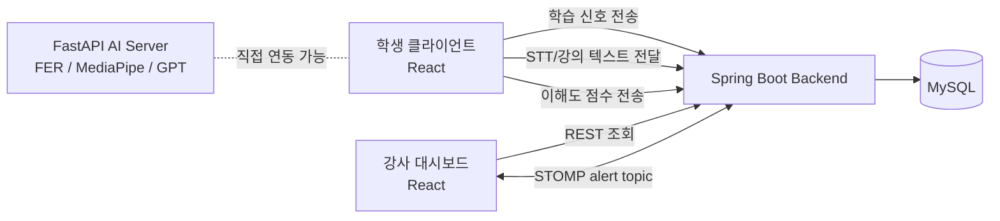
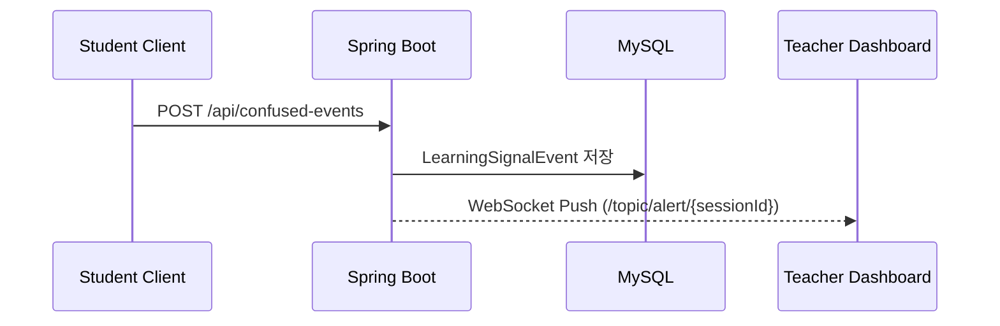
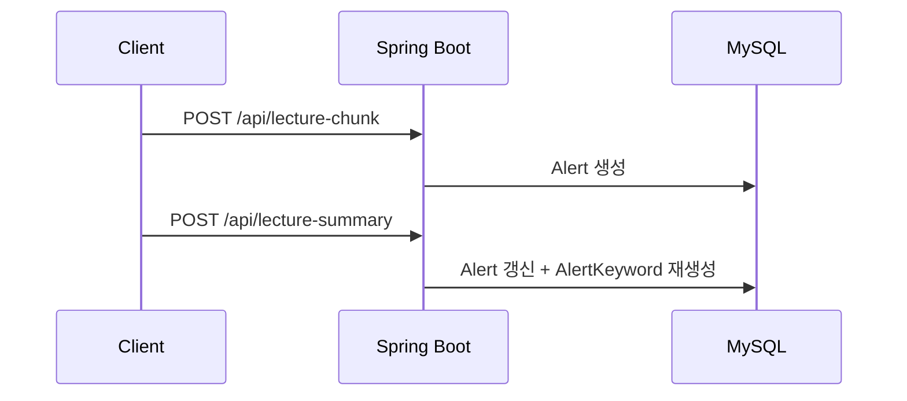
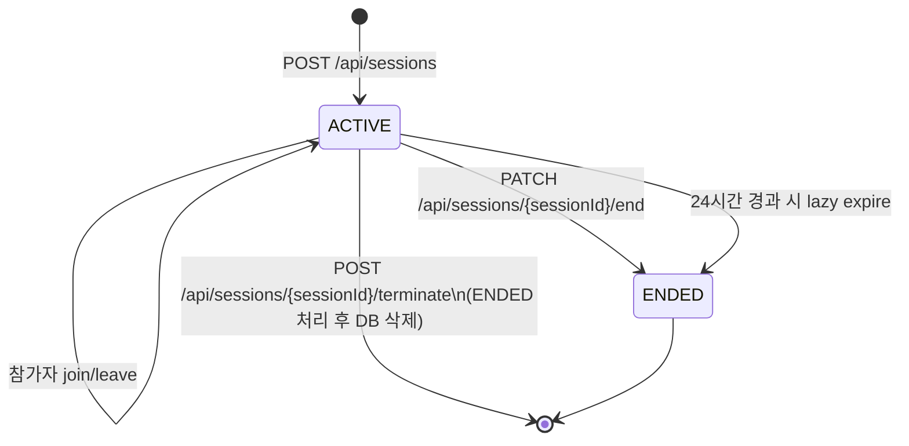
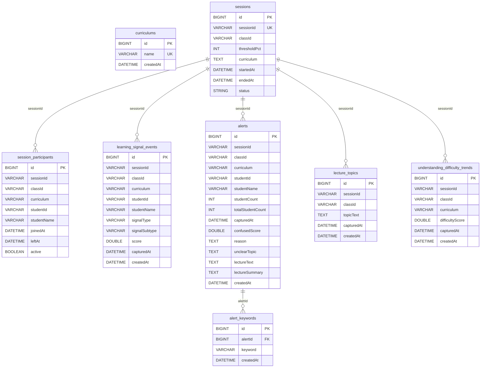

# iKnow Spring Boot Backend

실시간 학습 신호, 강의 요약, 대시보드 집계를 담당하는 `iKnow` 백엔드입니다.  
학생 클라이언트에서 발생한 학습 신호와 강의 텍스트를 저장하고, 강사 대시보드에 실시간 알림과 수업 단위 분석 데이터를 제공합니다.

## 핵심 업데이트

- `GET /api/sessions/{sessionId}` 응답에 `activeParticipantCount`가 추가되었습니다.
- `POST /api/understanding-difficulty-trends` API가 추가되었습니다.
- `GET /api/dashboard/classes` 응답에 시간대별 `difficultyTrend`가 포함됩니다.
- 강의 요약 키워드 정규화 규칙이 변경되어, 중복 제거 후 최대 5개까지 저장합니다.
- 기존 SVG 다이어그램은 모두 Mermaid 다이어그램으로 교체했습니다.

## 기술 스택

| 구분 | 내용 |
|---|---|
| Language | Java 21 |
| Framework | Spring Boot 4.0.5 |
| Build | Gradle |
| Persistence | Spring Data JPA |
| Database | MySQL 8 |
| Realtime | Spring WebSocket, STOMP, SockJS |
| Timezone | Asia/Seoul |

## 시스템 구성



## 주요 흐름

### 1. 학습 신호와 실시간 알림



### 2. 강의 텍스트 요약 반영



### 3. 세션 라이프사이클



## 데이터 모델



## 프로젝트 구조

```text
src/main/java/com/iknow
├─ config
│  ├─ CorsConfig.java
│  └─ WebSocketConfig.java
├─ controller
│  ├─ AlertController.java
│  ├─ ConfusedEventController.java
│  ├─ CurriculumController.java
│  ├─ DashboardController.java
│  ├─ LectureChunkController.java
│  ├─ LectureSummaryController.java
│  ├─ SessionController.java
│  ├─ SessionParticipantController.java
│  └─ UnderstandingDifficultyTrendController.java
├─ dto
│  ├─ request
│  └─ response
├─ entity
├─ repository
└─ service
```

## 실행 방법

### 요구 사항

- Java 21+
- MySQL 8

### 실행

```bash
./gradlew bootRun
```

### 주요 설정 파일

- `src/main/resources/application.yml`
- 기본 서버 포트: `8080`
- Jackson / Hibernate timezone: `Asia/Seoul`

## API 요약

기준 Base URL: `http://localhost:8080`

### Session

| Method | Path | 설명 |
|---|---|---|
| POST | `/api/sessions` | 세션 생성 |
| GET | `/api/sessions/{sessionId}` | 세션 조회 |
| PATCH | `/api/sessions/{sessionId}/end` | 세션 종료 |
| POST | `/api/sessions/{sessionId}/terminate` | 세션 종료 후 DB 삭제 |

#### `POST /api/sessions`

요청 필드

| 필드 | 타입 | 필수 | 설명 |
|---|---|---|---|
| `classId` | String | O | 반 ID |
| `curriculum` | String | O | 등록된 커리큘럼 이름 |
| `thresholdPct` | Integer | X | 기본값 `50` |

응답 주요 필드

| 필드 | 설명 |
|---|---|
| `sessionId` | 8자리 영문 대문자+숫자 |
| `status` | `ACTIVE` 또는 `ENDED` |
| `activeParticipantCount` | 현재 활성 참가자 수 |

예시

```json
{
  "sessionId": "AB12CD34",
  "classId": "A반",
  "thresholdPct": 50,
  "curriculum": "자격증반",
  "status": "ACTIVE",
  "startedAt": "2026-04-13T13:00:00",
  "endedAt": null,
  "activeParticipantCount": 0
}
```

### Session Participant

| Method | Path | 설명 |
|---|---|---|
| POST | `/api/sessions/{sessionId}/participants/join` | 참가자 입장 |
| POST | `/api/sessions/{sessionId}/participants/leave` | 참가자 퇴장 |

요청 예시

```json
{
  "studentId": "student-001",
  "studentName": "홍길동"
}
```

### Learning Signal / Alert

| Method | Path | 설명 |
|---|---|---|
| POST | `/api/confused-events` | 학습 신호 저장 + WebSocket 알림 |
| GET | `/api/sessions/{sessionId}/confused-events` | 세션별 학습 신호 목록 |
| GET | `/api/sessions/{sessionId}/alerts` | 세션별 알림 목록 |
| DELETE | `/api/alerts/{alertId}` | 알림 삭제 |

#### `POST /api/confused-events`

요청 필드

| 필드 | 타입 | 설명 |
|---|---|---|
| `sessionId` | String | 세션 ID |
| `studentId` | String | 학생 ID |
| `studentName` | String | 학생 이름 |
| `studentCount` | Integer | 혼란 학생 수 |
| `totalStudentCount` | Integer | 전체 학생 수 |
| `capturedAt` | LocalDateTime | 수집 시각 |
| `confusedScore` | Double | 혼란 점수 |
| `reason` | String | 혼란 사유 |
| `signalType` | String | 예: `GAZE_AWAY`, `MANUAL_HELP`, `FACIAL_INSTABILITY` |
| `signalSubtype` | String | 세부 유형 |

### Lecture Chunk / Summary

| Method | Path | 설명 |
|---|---|---|
| POST | `/api/lecture-chunk` | 강의 텍스트 기반 Alert 생성 |
| POST | `/api/lecture-summary` | 요약, 추천 개념, 키워드 저장 |
| GET | `/api/alerts/{alertId}/summary` | 요약 조회 |

#### `POST /api/lecture-summary`

요청 예시

```json
{
  "alertId": 1,
  "summary": "학생들이 분수 통분 개념에서 분모를 맞추는 흐름을 어려워함",
  "recommendedConcept": "분수 통분 개념 재설명 필요",
  "keywords": ["분수", "통분", "분모 맞추기", "약분", "공통분모"]
}
```

키워드 저장 규칙

- `null`, 빈 문자열 제거
- 공백 정규화
- 각 키워드는 최대 3단어까지 사용
- 중복 제거
- 최대 5개까지 저장

### Dashboard

| Method | Path | 설명 |
|---|---|---|
| GET | `/api/dashboard/classes?date=YYYY-MM-DD` | 날짜별 반 대시보드 집계 |
| GET | `/api/dashboard/keyword-report?date=...&keyword=...` | 키워드 리포트 |
| POST | `/api/dashboard/ai-coaching-data` | AI 코칭 화면용 집계 |

#### `GET /api/dashboard/classes`

응답 주요 필드

| 필드 | 설명 |
|---|---|
| `alertCount` | 알림 개수 |
| `participantCount` | 고유 참가자 수 |
| `avgConfusedScore` | 평균 혼란도 |
| `signalBreakdown` | 신호 유형별 집계 |
| `difficultyTrend` | 시간대별 평균 난이도 추이 |
| `topTopics` | 자주 등장한 난해 토픽 |
| `recentAlerts` | 최근 알림 목록 |

`difficultyTrend` 예시

```json
[
  {
    "time": "10:00",
    "avgDifficultyScore": 62.5,
    "sampleCount": 4
  },
  {
    "time": "11:00",
    "avgDifficultyScore": 71.3,
    "sampleCount": 3
  }
]
```

### Understanding Difficulty Trend

| Method | Path | 설명 |
|---|---|---|
| POST | `/api/understanding-difficulty-trends` | 이해도 난이도 추이 저장 |

요청 예시

```json
{
  "sessionId": "AB12CD34",
  "difficultyScore": 68.4,
  "capturedAt": "2026-04-13T18:30:00"
}
```

응답 예시

```json
{
  "id": 1,
  "sessionId": "AB12CD34",
  "classId": "A반",
  "curriculum": "자격증반",
  "difficultyScore": 68.4,
  "capturedAt": "2026-04-13T18:30:00",
  "createdAt": "2026-04-13T18:30:01"
}
```

주의 사항

- 활성 세션만 저장할 수 있습니다.
- `difficultyScore`는 `0.0 ~ 100.0` 범위로 보정됩니다.
- 대시보드에서는 시간 단위로 평균 집계되어 `difficultyTrend`로 노출됩니다.

### Curriculum

| Method | Path | 설명 |
|---|---|---|
| GET | `/api/curriculums` | 커리큘럼 목록 조회 |
| POST | `/api/curriculums` | 커리큘럼 생성 |
| DELETE | `/api/curriculums/{curriculumId}` | 커리큘럼 삭제 |

## WebSocket

### 연결 정보

- Endpoint: `ws://localhost:8080/ws`
- Protocol: `STOMP over SockJS`
- Topic: `/topic/alert/{sessionId}`

### Push Payload 예시

```json
{
  "sessionId": "AB12CD34",
  "classId": "A반",
  "studentCount": 3,
  "totalStudentCount": 20,
  "confusedScore": 0.75,
  "reason": "분수 개념 이해 부족",
  "capturedAt": "2026-04-13T18:20:00"
}
```

## 구현 메모

- 세션 ID는 `A-Z`, `0-9` 조합의 8자리 문자열이며 충돌 시 재생성합니다.
- 세션 조회 시 24시간이 지난 활성 세션은 lazy 방식으로 `ENDED` 처리됩니다.
- 세션 강제 종료 시 활성 참가자는 모두 퇴장 처리한 뒤 세션 레코드를 삭제합니다.
- 대시보드 집계는 `curriculum + classId` 기준으로 묶습니다.
- `Alert`는 강의 요약 결과까지 포함한 분석 레코드이고, `LearningSignalEvent`는 실시간 원시 신호 이벤트입니다.
