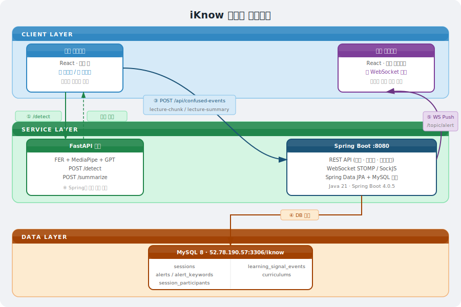
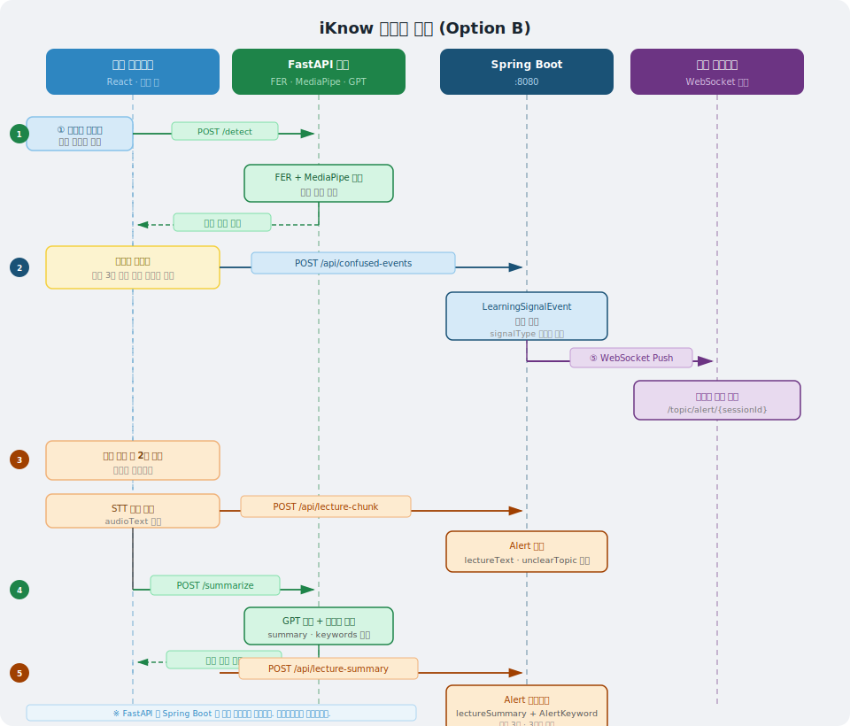
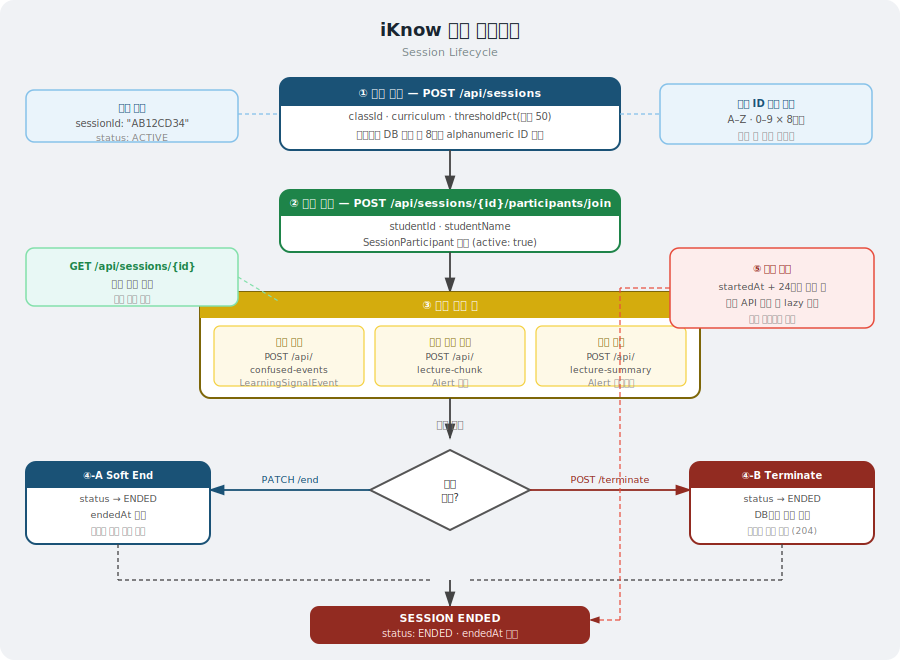
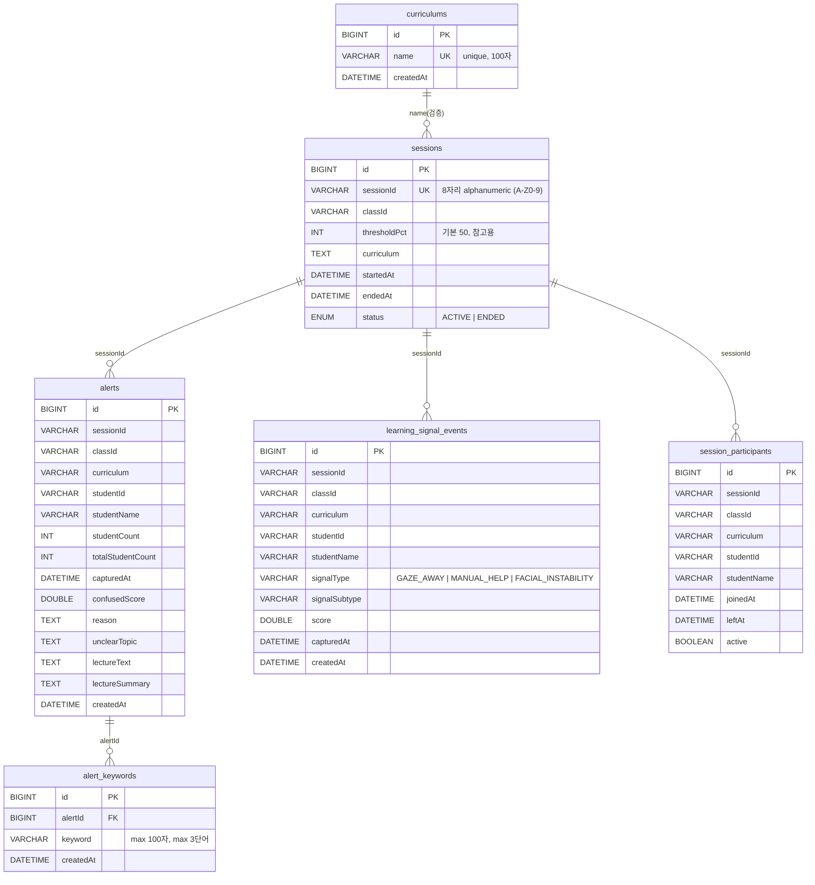

# iKnow — Spring Boot Backend

실시간 학습자 혼란 감지 시스템의 백엔드 서버입니다.  
강사 대시보드에 혼란 신호를 실시간으로 전달하고, 강의 요약 및 키워드 분석 데이터를 제공합니다.

---

## 목차

1. [기술 스택](#기술-스택)
2. [시스템 아키텍처](#시스템-아키텍처)
3. [데이터 흐름](#데이터-흐름)
4. [ERD](#erd)
5. [프로젝트 구조](#프로젝트-구조)
6. [실행 방법](#실행-방법)
7. [API 명세](#api-명세)
8. [WebSocket 명세](#websocket-명세)
9. [주요 설계 결정](#주요-설계-결정)

---

## 기술 스택

| 분류 | 기술 |
|------|------|
| Language | Java 21 |
| Framework | Spring Boot 4.0.5 |
| Persistence | Spring Data JPA + MySQL 8 |
| Real-time | Spring WebSocket (STOMP + SockJS) |
| DB Server | MySQL 8 @ 52.78.190.57:3306/iknow |
| Timezone | Asia/Seoul (전역 설정) |
| Build | Gradle |

---

## 시스템 아키텍처



```
┌─────────────────────────────────────────────────────────────────────┐
│                        클라이언트 레이어                              │
│                                                                     │
│   ┌──────────────────┐              ┌──────────────────────────┐    │
│   │   학생 브라우저    │              │     강사 브라우저          │    │
│   │  (React / 학생앱) │              │   (React / 강사 대시보드)  │    │
│   └────────┬─────────┘              └───────────┬──────────────┘    │
│            │                                    │                   │
└────────────┼────────────────────────────────────┼───────────────────┘
             │                                    │
             │ ① 영상/마이크 스트림                 │ ⑤ WebSocket 구독
             │ ② confused 신호 감지 (프론트 필터링)  │    /topic/alert/{sessionId}
             │                                    │
┌────────────▼────────────────────────────────────┼───────────────────┐
│                      서비스 레이어                │                   │
│                                                 │                   │
│  ┌───────────────────────────┐      ┌───────────▼──────────────┐   │
│  │       FastAPI 서버         │      │     Spring Boot 서버      │   │
│  │  (FER + MediaPipe + GPT)  │      │        :8080              │   │
│  │                           │      │                           │   │
│  │  /detect  ← 영상 프레임    │      │  REST API                 │   │
│  │  /summarize ← 강의 텍스트  │      │  WebSocket Push           │   │
│  │                           │      │                           │   │
│  └───────────┬───────────────┘      └───────────┬──────────────┘   │
│              │                                  │                   │
│    ③ GPT 요약 결과 반환 (프론트 수신 후 → Spring)│ ④ DB 저장         │
│    (Spring은 FastAPI에 직접 연결하지 않음)        │                   │
│                                                 │                   │
└─────────────────────────────────────────────────┼───────────────────┘
                                                  │
                                    ┌─────────────▼──────────┐
                                    │       MySQL DB          │
                                    │  sessions               │
                                    │  alerts                 │
                                    │  alert_keywords         │
                                    │  learning_signal_events │
                                    │  session_participants   │
                                    │  curriculums            │
                                    └────────────────────────┘
```

---

## 데이터 흐름

### 혼란 감지 이벤트 흐름 (Option B)



```
학생 브라우저
    │
    ├── 카메라/마이크 스트림 → FastAPI /detect
    │       └── FER + MediaPipe 로 혼란 점수 계산
    │
    ├── [프론트가 직접 필터링]
    │       └── 연속 3회 이상 감지 시에만 Spring으로 전송
    │
    ├── POST /api/confused-events ──────────────► Spring Boot
    │       (signalType, score, studentId 등)         │
    │                                                  ├── LearningSignalEvent 저장
    │                                                  └── WebSocket Push
    │                                                       /topic/alert/{sessionId}
    │                                                            │
    │                                                       강사 브라우저 (실시간 알림)
    │
    └── [혼란 확정 후 2분 녹음]
            ├── STT 변환 → audioText
            ├── POST /api/lecture-chunk ──────────► Alert 저장 (lectureText, unclearTopic)
            ├── FastAPI /summarize 직접 호출 (프론트)
            │       └── GPT 요약 + 키워드 추출
            └── POST /api/lecture-summary ────────► Alert 업데이트 (lectureSummary, keywords)
```

### 세션 생명주기



```
강사
 │
 ├── POST /api/sessions (classId, curriculum, thresholdPct)
 │       └── 8자리 alphanumeric ID 생성 (A-Z0-9)
 │           중복 시 재생성 (collision-safe)
 │
 ├── 학생들 입장: POST /api/sessions/{id}/participants/join
 │
 ├── 수업 진행 (confused 이벤트 수신 / 강의 청크 저장)
 │
 ├── 수업 종료 선택지:
 │       ├── PATCH /api/sessions/{id}/end         → ENDED + 참가자 전원 퇴장
 │       └── POST /api/sessions/{id}/terminate    → ENDED + DB에서 물리 삭제
 │
 └── 자동 만료: startedAt + 24시간 초과 시 ENDED로 lazy 전환
```

---

## ERD

```
┌──────────────────┐         ┌──────────────────────────────────────────┐
│    curriculums   │         │                 sessions                 │
├──────────────────┤         ├──────────────────────────────────────────┤
│ PK id BIGINT     │         │ PK id           BIGINT                   │
│    name VARCHAR  │◄── 검증 ─│    sessionId    VARCHAR(8) UNIQUE        │
│    createdAt     │         │    classId      VARCHAR                  │
└──────────────────┘         │    thresholdPct INT  (참고용, 기본 50)    │
                             │    curriculum   TEXT                     │
                             │    startedAt    DATETIME NOT NULL        │
                             │    endedAt      DATETIME                 │
                             │    status       ENUM(ACTIVE, ENDED)      │
                             └──────────────┬───────────────────────────┘
                                            │ sessionId (논리적 참조)
                   ┌────────────────────────┼────────────────────────┐
                   │                        │                        │
       ┌───────────▼──────────┐  ┌──────────▼──────────┐  ┌─────────▼──────────────┐
       │       alerts         │  │  learning_signal     │  │  session_participants  │
       ├──────────────────────┤  │      _events         │  ├────────────────────────┤
       │ PK id    BIGINT      │  ├──────────────────────┤  │ PK id       BIGINT     │
       │    sessionId VARCHAR │  │ PK id    BIGINT      │  │    sessionId VARCHAR   │
       │    classId   VARCHAR │  │    sessionId VARCHAR │  │    classId   VARCHAR   │
       │    curriculum VARCHAR│  │    classId   VARCHAR │  │    curriculum VARCHAR  │
       │    studentId VARCHAR │  │    curriculum VARCHAR│  │    studentId VARCHAR   │
       │    studentName       │  │    studentId VARCHAR │  │    studentName VARCHAR │
       │    studentCount INT  │  │    studentName       │  │    joinedAt  DATETIME  │
       │    totalStudentCount │  │    signalType VARCHAR│  │    leftAt    DATETIME  │
       │    capturedAt DATETIME│ │    signalSubtype     │  │    active    BOOLEAN   │
       │    confusedScore DBLE│  │    score     DOUBLE │   └────────────────────────┘
       │    reason    TEXT    │  │    capturedAt DATETIME│
       │    unclearTopic TEXT │  │    createdAt DATETIME │
       │    lectureText  TEXT │  └──────────────────────┘
       │    lectureSummary TEXT│
       │    createdAt DATETIME│
       └──────────┬───────────┘
                  │
       ┌──────────▼───────────┐
       │   alert_keywords     │
       ├──────────────────────┤
       │ PK id     BIGINT     │
       │ FK alertId BIGINT    │ ── alerts.id 참조
       │    keyword VARCHAR(100)│  (최대 3개, 단어 3개 이내)
       │    createdAt DATETIME│
       └──────────────────────┘
```

### Mermaid ERD



---

## 프로젝트 구조

```
be/
├── src/main/java/com/iknow/
│   ├── IknowApplication.java               # 진입점 + KST 설정 + Curriculum 시드
│   │
│   ├── config/
│   │   ├── WebSocketConfig.java            # STOMP /ws 엔드포인트, /topic 브로커
│   │   └── CorsConfig.java                 # 전체 도메인 CORS 허용
│   │
│   ├── entity/
│   │   ├── Session.java                    # 세션 (8자리 ID, ACTIVE/ENDED)
│   │   ├── Alert.java                      # 혼란 이벤트 + 강의 요약
│   │   ├── AlertKeyword.java               # Alert 키워드 (최대 3개, 3단어 이내)
│   │   ├── LearningSignalEvent.java        # 원시 신호 이벤트 (DB 인덱스 포함)
│   │   ├── SessionParticipant.java         # 참가자 입퇴장 (DB 인덱스 포함)
│   │   └── Curriculum.java                 # 커리큘럼 마스터
│   │
│   ├── repository/
│   │   ├── SessionRepository.java
│   │   ├── AlertRepository.java
│   │   ├── AlertKeywordRepository.java
│   │   ├── LearningSignalEventRepository.java
│   │   ├── SessionParticipantRepository.java
│   │   └── CurriculumRepository.java
│   │
│   ├── service/
│   │   ├── SessionService.java             # 세션 CRUD, ID 생성, 24h 자동 만료
│   │   ├── SessionParticipantService.java  # 참가자 입퇴장 관리
│   │   ├── ConfusedEventService.java       # 신호 저장 + WebSocket Push
│   │   ├── LectureChunkService.java        # Alert 생성 (STT 원문)
│   │   ├── LectureSummaryService.java      # Alert 업데이트 (GPT 요약 + 키워드)
│   │   ├── DashboardService.java           # 대시보드 데이터 집계
│   │   ├── DashboardAiCoachingService.java # AI 코칭 데이터 빌더
│   │   └── CurriculumService.java
│   │
│   ├── controller/
│   │   ├── SessionController.java
│   │   ├── SessionParticipantController.java
│   │   ├── ConfusedEventController.java
│   │   ├── LectureChunkController.java
│   │   ├── LectureSummaryController.java
│   │   ├── DashboardController.java
│   │   ├── AlertController.java
│   │   └── CurriculumController.java
│   │
│   └── dto/
│       ├── request/
│       │   ├── CreateSessionRequest.java
│       │   ├── SessionParticipantRequest.java
│       │   ├── ConfusedEventRequest.java
│       │   ├── LectureChunkRequest.java
│       │   ├── LectureSummaryRequest.java
│       │   ├── DashboardAiCoachingRequest.java
│       │   └── CreateCurriculumRequest.java
│       └── response/
│           ├── SessionResponse.java
│           ├── AlertResponse.java
│           ├── AlertWebSocketPayload.java
│           ├── LearningSignalEventResponse.java
│           ├── DashboardClassResponse.java
│           ├── SignalBreakdownResponse.java
│           ├── KeywordReportResponse.java
│           ├── DashboardAiCoachingDataResponse.java
│           ├── DashboardAiSignalItemResponse.java
│           ├── DashboardAiRecentAlertItemResponse.java
│           └── CurriculumResponse.java
│
└── src/main/resource/
    └── application.yml
```

---

## 실행 방법

### 사전 요구사항

- Java 21+
- MySQL 8 (접속 정보는 `application.yml` 참고)

### application.yml 주요 설정

```yaml
spring:
  datasource:
    url: jdbc:mysql://52.78.190.57:3306/iknow?useSSL=false&allowPublicKeyRetrieval=true&serverTimezone=Asia/Seoul&characterEncoding=UTF-8
    username: root
    password: (비밀번호)
  jpa:
    hibernate:
      ddl-auto: update
    properties:
      hibernate:
        dialect: org.hibernate.dialect.MySQLDialect
        jdbc.time_zone: Asia/Seoul
  jackson:
    time-zone: Asia/Seoul
server:
  port: 8080
```

### 실행

```bash
./gradlew bootRun
```

**초기 시드 데이터**: 최초 실행 시 `curriculums` 테이블에 `자격증반`, `웹개발반` 자동 삽입됩니다.

---

## API 명세

### 공통

- Base URL: `http://localhost:8080`
- Content-Type: `application/json`
- 날짜/시간 형식: ISO 8601 (예: `2024-01-15T09:30:00`)
- 날짜 형식: `yyyy-MM-dd` (예: `2024-01-15`)

---

### 1. 세션 (Session)

#### 세션 생성

```
POST /api/sessions
```

**Request Body**

| 필드 | 타입 | 필수 | 설명 |
|------|------|------|------|
| classId | String | O | 반 ID |
| curriculum | String | O | 커리큘럼명 (DB 등록된 이름만 허용) |
| thresholdPct | Integer | X | 혼란 감지 임계값 % (기본값 50, 참고용) |

```json
{
  "classId": "A반",
  "curriculum": "자격증반",
  "thresholdPct": 50
}
```

**Response 200**

```json
{
  "sessionId": "AB12CD34",
  "classId": "A반",
  "curriculum": "자격증반",
  "thresholdPct": 50,
  "status": "ACTIVE",
  "startedAt": "2024-01-15T09:00:00",
  "endedAt": null
}
```

> `sessionId`는 대문자 알파벳 + 숫자 8자리 랜덤 생성. 충돌 시 자동 재생성.

---

#### 세션 조회

```
GET /api/sessions/{sessionId}
```

**Response 200** → SessionResponse (위와 동일)

> 24시간 초과 시 `status: "ENDED"` 자동 반환

---

#### 세션 종료 (Soft End)

```
PATCH /api/sessions/{sessionId}/end
```

**Response 200** → SessionResponse (`status: "ENDED"`, `endedAt` 설정)

> 모든 활성 참가자를 자동으로 퇴장 처리합니다.

---

#### 세션 강제 종료 (Terminate + DB 삭제)

```
POST /api/sessions/{sessionId}/terminate
```

**Response 204 No Content**

> 세션을 ENDED 처리 후 DB에서 물리 삭제합니다. 세션이 없어도 정상 응답합니다.

---

### 2. 세션 참가자 (SessionParticipant)

#### 입장

```
POST /api/sessions/{sessionId}/participants/join
```

**Request Body**

```json
{
  "studentId": "student-001",
  "studentName": "홍길동"
}
```

**Response 204 No Content**

---

#### 퇴장

```
POST /api/sessions/{sessionId}/participants/leave
```

**Request Body** → 입장과 동일

**Response 204 No Content**

---

### 3. 혼란 이벤트 (ConfusedEvent)

#### 혼란 신호 수신

```
POST /api/confused-events
```

프론트엔드가 연속 3회 이상 혼란 감지 시 전송합니다.  
`LearningSignalEvent`를 저장하고 강사 브라우저로 WebSocket Push를 발송합니다.

**Request Body**

| 필드 | 타입 | 필수 | 설명 |
|------|------|------|------|
| sessionId | String | O | 세션 ID |
| studentId | String | X | 학생 ID |
| studentName | String | X | 학생 이름 |
| studentCount | Integer | X | 혼란 학생 수 (기본 1) |
| totalStudentCount | Integer | X | 전체 학생 수 (기본 1) |
| capturedAt | DateTime | X | 감지 시각 |
| confusedScore | Double | X | 혼란 점수 (0.0~1.0) |
| reason | String | X | 혼란 원인 설명 |
| signalType | String | X | `GAZE_AWAY` / `MANUAL_HELP` / `FACIAL_INSTABILITY` |
| signalSubtype | String | X | `MANUAL_BUTTON` 등 |

```json
{
  "sessionId": "AB12CD34",
  "studentId": "student-001",
  "studentName": "홍길동",
  "studentCount": 3,
  "totalStudentCount": 20,
  "capturedAt": "2024-01-15T10:30:00",
  "confusedScore": 0.75,
  "reason": "분수 개념 이해 부족",
  "signalType": "FACIAL_INSTABILITY",
  "signalSubtype": null
}
```

**Response 200 OK** (본문 없음)

**signalType 정규화 규칙**

| 조건 | 저장값 |
|------|--------|
| `signalType` 없음 + `signalSubtype == "MANUAL_BUTTON"` | `MANUAL_HELP` |
| `signalType` 있음 | 그대로 사용 |
| 그 외 | `FACIAL_INSTABILITY` |

---

#### 세션 알림 이력 조회

```
GET /api/sessions/{sessionId}/alerts
```

**Response 200**

```json
[
  {
    "id": 1,
    "sessionId": "AB12CD34",
    "classId": "A반",
    "curriculum": "자격증반",
    "studentId": "student-001",
    "studentName": "홍길동",
    "studentCount": 3,
    "totalStudentCount": 20,
    "capturedAt": "2024-01-15T10:30:00",
    "confusedScore": 0.75,
    "reason": "분수 개념 이해 부족",
    "unclearTopic": "분수의 덧셈",
    "lectureText": "분수를 더할 때는 분모를...",
    "lectureSummary": "분수 덧셈 시 분모 통일 필요",
    "keywords": ["분수", "덧셈", "분모"],
    "createdAt": "2024-01-15T10:30:05"
  }
]
```

---

#### 세션 혼란 이벤트 목록 조회

```
GET /api/sessions/{sessionId}/confused-events
```

**Response 200**

```json
[
  {
    "id": 1,
    "sessionId": "AB12CD34",
    "classId": "A반",
    "curriculum": "자격증반",
    "studentId": "student-001",
    "studentName": "홍길동",
    "signalType": "FACIAL_INSTABILITY",
    "signalSubtype": null,
    "score": 0.75,
    "capturedAt": "2024-01-15T10:30:00",
    "createdAt": "2024-01-15T10:30:01"
  }
]
```

---

#### 알림 삭제 (PASS 버튼)

```
DELETE /api/alerts/{alertId}
```

강사가 알림을 무시(PASS)할 때 사용합니다.

**Response 204 No Content**

---

### 4. 강의 청크 (LectureChunk)

혼란 확정 후 2분 녹음된 STT 결과를 저장합니다. `Alert`를 신규 생성합니다.

```
POST /api/lecture-chunk
```

**Request Body**

| 필드 | 타입 | 필수 | 설명 |
|------|------|------|------|
| sessionId | String | O | 세션 ID |
| audioText | String | X | STT 변환 텍스트 |
| studentCount | Integer | X | 혼란 학생 수 |
| totalStudentCount | Integer | X | 전체 학생 수 |
| capturedAt | DateTime | X | 녹음 시작 시각 |
| confusedScore | Double | X | 혼란 점수 |
| reason | String | X | 혼란 원인 |

```json
{
  "sessionId": "AB12CD34",
  "audioText": "분수를 더할 때는 분모를 같게 맞춰야 합니다...",
  "studentCount": 3,
  "totalStudentCount": 20,
  "capturedAt": "2024-01-15T10:30:00",
  "confusedScore": 0.75,
  "reason": "분수 개념"
}
```

**Response 200** → AlertResponse

> `classId`, `curriculum`은 세션에서 자동 추출됩니다.

---

### 5. 강의 요약 (LectureSummary)

FastAPI `/summarize`가 반환한 GPT 요약 결과를 저장합니다.  
프론트엔드가 FastAPI를 직접 호출한 후, 결과를 이 API로 전달합니다.

#### 요약 저장

```
POST /api/lecture-summary
```

**Request Body**

| 필드 | 타입 | 필수 | 설명 |
|------|------|------|------|
| alertId | Long | O | 저장할 Alert ID |
| summary | String | X | GPT 요약문 |
| recommendedConcept | String | X | 보충 개념 (Alert.reason 에 덮어씀) |
| keywords | List\<String\> | X | 핵심 키워드 (최대 3개, 단어 3개 이내) |

```json
{
  "alertId": 1,
  "summary": "학생들이 분수의 덧셈에서 분모 통일 개념을 어려워함",
  "recommendedConcept": "분수 덧셈 개념 재설명 필요",
  "keywords": ["분수", "분모", "덧셈"]
}
```

**Response 200** → AlertResponse

**키워드 정규화 규칙**:
- null/빈 값 제거
- 각 키워드는 최대 3단어 (초과 시 앞 3단어만 사용)
- 중복 제거 후 최대 3개만 저장

---

#### 요약 조회

```
GET /api/alerts/{alertId}/summary
```

**Response 200** → AlertResponse

---

### 6. 대시보드 (Dashboard)

#### 반별 통계 조회

```
GET /api/dashboard/classes?date=2024-01-15
```

지정된 날짜의 모든 반별 혼란 이벤트 통계를 반환합니다.

**Query Parameters**

| 파라미터 | 타입 | 필수 | 설명 |
|---------|------|------|------|
| date | LocalDate | O | 조회 날짜 (yyyy-MM-dd) |

**Response 200**

```json
[
  {
    "curriculum": "자격증반",
    "classId": "A반",
    "alertCount": 5,
    "participantCount": 20,
    "avgConfusedScore": 0.65,
    "signalBreakdown": [
      {
        "signalType": "FACIAL_INSTABILITY",
        "label": "표정 기반 불안정",
        "count": 10,
        "ratio": 0.67
      },
      {
        "signalType": "GAZE_AWAY",
        "label": "시선 이탈 / 화면 이탈",
        "count": 5,
        "ratio": 0.33
      }
    ],
    "topTopics": ["분수", "소수점", "방정식"],
    "recentAlerts": []
  }
]
```

**signalType 라벨 매핑**

| signalType | label |
|---|---|
| `GAZE_AWAY` | 시선 이탈 / 화면 이탈 |
| `MANUAL_HELP` | 학생 직접 반응 |
| `FACIAL_INSTABILITY` | 표정 기반 불안정 |
| 그 외 | 기타 신호 |

> 결과는 `curriculum` → `classId` 순으로 정렬됩니다.

---

#### 키워드 리포트 조회

```
GET /api/dashboard/keyword-report?date=2024-01-15&keyword=분수&curriculum=자격증반&classId=A반
```

특정 키워드에 대한 혼란 분석 리포트를 반환합니다.

**Query Parameters**

| 파라미터 | 타입 | 필수 | 설명 |
|---------|------|------|------|
| date | LocalDate | O | 조회 날짜 |
| keyword | String | O | 분석할 키워드 |
| curriculum | String | X | 커리큘럼 필터 (생략 시 전체) |
| classId | String | X | 반 필터 (생략/`전체 반` 시 전체 반 조회) |

**Response 200**

```json
{
  "keyword": "분수",
  "curriculum": "자격증반",
  "classId": "A반",
  "date": "2024-01-15",
  "alertCount": 3,
  "avgUnderstanding": 35,
  "reinforcementNeed": 65,
  "reinforcementLevel": "높음",
  "report": "'분수' 관련 알림은 3건이며 평균 이해도는 35%입니다. 보충 필요도는 높음(65%)로 판단됩니다.",
  "occurrenceTimes": ["09:30", "10:15", "11:00"]
}
```

**reinforcementLevel 기준**

| 조건 | 값 |
|------|-----|
| reinforcementNeed ≥ 70 | `"높음"` |
| reinforcementNeed ≥ 40 | `"보통"` |
| reinforcementNeed < 40 | `"낮음"` |

---

#### AI 코칭 데이터 조회

```
POST /api/dashboard/ai-coaching-data
```

AI 코칭 패널에서 사용할 집계 데이터를 반환합니다.

**Request Body**

```json
{
  "date": "2024-01-15",
  "curriculum": "자격증반",
  "classId": "A반"
}
```

> `curriculum`, `classId`가 null이거나 빈 문자열이면 전체 조회.  
> `classId == "전체 반"`도 전체 조회로 처리됩니다.

**Response 200**

```json
{
  "date": "2024-01-15",
  "curriculum": "자격증반",
  "classId": "A반",
  "classIds": ["A반", "B반"],
  "participantCount": 45,
  "alertCount": 12,
  "avgConfusionPercent": 62,
  "topKeywords": ["분수", "방정식", "소수점", "함수", "미분"],
  "topTopics": ["분수의 덧셈", "1차 방정식"],
  "signalBreakdown": [
    {
      "signalType": "FACIAL_INSTABILITY",
      "label": "표정 기반 불안정",
      "count": 20
    }
  ],
  "recentAlerts": [
    {
      "classId": "A반",
      "capturedAt": "2024-01-15T11:00:00",
      "topic": "분수 덧셈 시 분모 통일 필요",
      "reason": "분수 개념 재설명 필요",
      "confusionPercent": 70
    }
  ]
}
```

---

### 7. 커리큘럼 (Curriculum)

#### 커리큘럼 목록 조회

```
GET /api/curriculums
```

**Response 200**

```json
[
  { "id": 1, "name": "자격증반" },
  { "id": 2, "name": "웹개발반" }
]
```

---

#### 커리큘럼 생성

```
POST /api/curriculums
```

```json
{ "name": "데이터분석반" }
```

**Response 201 Created**

```json
{ "id": 3, "name": "데이터분석반" }
```

---

#### 커리큘럼 삭제

```
DELETE /api/curriculums/{curriculumId}
```

**Response 204 No Content**

---

## WebSocket 명세

### 연결

| 항목 | 값 |
|------|-----|
| 엔드포인트 | `ws://localhost:8080/ws` (SockJS) |
| 프로토콜 | STOMP over SockJS |

### 구독

강사 브라우저는 세션 생성 후 아래 토픽을 구독합니다.

```
/topic/alert/{sessionId}
```

### Push 페이로드

`POST /api/confused-events` 수신 시 즉시 발송됩니다.

```json
{
  "sessionId": "AB12CD34",
  "classId": "A반",
  "studentCount": 3,
  "totalStudentCount": 20,
  "confusedScore": 0.75,
  "reason": "분수 개념 이해 부족",
  "capturedAt": "2024-01-15T10:30:00"
}
```

### 클라이언트 예시 (SockJS + STOMP)

```javascript
import SockJS from 'sockjs-client';
import { Client } from '@stomp/stompjs';

const client = new Client({
  webSocketFactory: () => new SockJS('http://localhost:8080/ws'),
  onConnect: () => {
    client.subscribe(`/topic/alert/${sessionId}`, (message) => {
      const payload = JSON.parse(message.body);
      console.log('혼란 알림:', payload);
    });
  },
});

client.activate();
```

---

## 주요 설계 결정

### Option B: 프론트 필터링

Spring은 FastAPI에 직접 연결하지 않습니다. 프론트엔드가 FER/MediaPipe 결과를 필터링(연속 3회 감지)하여 유의미한 혼란만 Spring으로 전송합니다. FastAPI `/summarize`도 프론트가 직접 호출한 후 결과를 Spring에 저장합니다.

### 8자리 alphanumeric 세션 ID

`A-Z`, `0-9` 조합의 8자리 랜덤 문자열 (예: `AB12CD34`). 충돌 시 자동 재생성(collision-safe). 총 36^8 ≈ 28억 가지 조합.

### Alert vs LearningSignalEvent 분리

- `LearningSignalEvent`: 원시 혼란 신호. `POST /api/confused-events` 수신 시 즉시 저장 + WebSocket Push.
- `Alert`: STT 2분 녹음 후 생성되는 분석 레코드. GPT 요약(`lectureSummary`)과 키워드(`AlertKeyword`)를 포함.

### ClassGroupingKey (curriculum + classId)

대시보드는 `(curriculum, classId)` 복합키로 반을 구분합니다. `sessionId → Session`에서 우선 조회하고, 없으면 Alert/LearningSignalEvent의 스냅샷 값을 사용합니다.

### 24시간 세션 자동 만료

`startedAt + 24h` 초과 시 다음 API 호출 시점에 자동으로 ENDED로 전환됩니다. 별도 스케줄러 없이 lazy 방식으로 처리합니다.

### 키워드 정규화 (AlertKeyword)

- Alert당 최대 3개
- 각 키워드는 최대 3단어 (초과 시 앞 3단어만 사용)
- 중복 제거 후 저장
- 요약 저장 시 기존 키워드를 전부 삭제 후 재삽입
